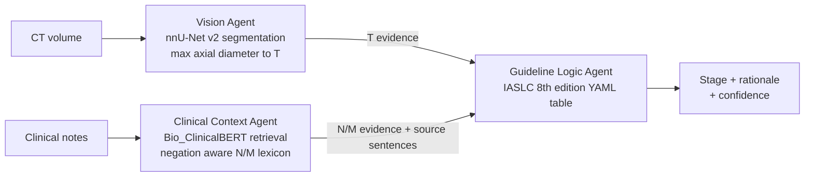

# Multi-Agent Framework for Automated NSCLC TNM Staging


MSc in Artificial Intelligence practicum, National College of Ireland (2026). Supervised by Arundev Vamadevan.

A multi-agent pipeline that stages non-small cell lung cancer (NSCLC) from two sources of evidence: CT imaging for the T factor and clinical notes for the N factor. Three agents are orchestrated with LangGraph, and every stage the system returns can be traced back to the mask measurement, the note sentence and the guideline rule that produced it.

> Research prototype only. Not a medical device and not validated for clinical use.

## Why this design

The original proposal used a generative LLM (Mistral 7B) with a ChromaDB vector store. I replaced both during the project.

Staging is a rule application problem with a published answer key. A generative model adds cost, latency and a risk of confident but unsupported output, and its reasoning is hard to audit. The final system keeps learned models only where perception is genuinely needed (tumour segmentation and sentence embeddings) and makes every staging decision deterministic and traceable. This also cut compute and energy use substantially, which I analysed separately as a green AI case study.

## Architecture



**Vision Agent** segments the primary tumour with nnU-Net v2 trained on NSCLC-Radiomics, keeps the largest connected component, measures the greatest axial diameter in millimetres and maps it to T1 to T4 using IASLC size thresholds. TotalSegmentator is included as a baseline and as future anatomical context for invasion criteria.

**Clinical Context Agent** splits notes into sentences, retrieves the most relevant ones by cosine similarity over Bio_ClinicalBERT embeddings (keyword fallback if the model is unavailable), and extracts N and M evidence with a negation aware lexicon. Each finding keeps a pointer to its source note and sentence.

**Guideline Logic Agent** validates the T, N and M tokens, resolves conflicts conservatively and looks up the stage group in `configs/iaslc_rules.yaml`. It returns the stage together with a rationale listing the evidence used.

**Orchestration** runs Vision and Clinical Context in parallel and joins them at the Guideline node using LangGraph, with a sequential fallback if LangGraph is not installed. A failure in one agent is recorded and passed on as empty evidence rather than crashing the pipeline.

## Results

Each component was evaluated separately so errors can be attributed to the right stage.

| Component | Evaluation | Result |
|---|---|---|
| Guideline engine | Every valid T/N/M combination checked against an independently hand coded IASLC oracle | **250/250 match** |
| Vision T classification | Size to T rule vs clinical T on NSCLC-Radiomics | ~0.38 accuracy |
| End to end stage | Predicted T + recorded N/M vs clinical stage | ~0.52 accuracy |
| Retrieval | Bio_ClinicalBERT retrieval vs reading the full record, and vs truncation at the same sentence budget (MIMIC-IV notes) | Ties full context; beats naive truncation under a fixed budget |
| Text only N staging | Clinical Context Agent vs silver standard N labels | Near chance |

What the numbers say:

* The rule layer is correct. Remaining errors come from perception and evidence, not from the guideline logic.
* Imaging is the bottleneck. Size alone cannot capture invasion based T3/T4 criteria, which is where most T errors occur.
* Retrieval earns its place when records are too long to read in full (median 19 notes per patient), but the notes themselves often lack enough nodal detail for reliable N staging.

## Scope and limitations

* **T and N only.** NSCLC-Radiomics contains almost no M1 cases, so M staging could not be evaluated meaningfully.
* **Labels.** NSCLC-Radiomics clinical T labels follow an older AJCC edition, and N labels for the text experiments are a silver standard extracted from explicit staging statements.
* **Invasion criteria** (chest wall, mediastinal, vertebral) are not yet modelled; TotalSegmentator anatomical masks are the planned route.
* **9th edition.** The rule table encodes the IASLC 8th edition. The 9th edition N2a/N2b and M1c1/M1c2 splits are documented in the YAML but not encoded.

## Repository structure

```
agents/
  vision/              nnU-Net inference, diameter measurement, size to T rule
  clinical_context/    sentence retrieval, negation aware N/M extraction
  guideline_logic/     validation, conflict resolution, stage lookup
orchestration/         LangGraph pipeline with sequential fallback
configs/
  iaslc_rules.yaml     IASLC 8th edition stage groups (single source of truth)
  base.yaml            default agent settings
scripts/
  preprocessing/       DICOM loading, resampling, nnU-Net dataset conversion
  evaluation/          guideline validation, staging eval, RAG experiments, baselines
notebooks/             EDA and experiment notebooks (MIMIC notebooks contain no outputs)
tests/                 133 unit and integration tests
docs/                  nnU-Net training guide (Vast.ai GPU)
```

## Getting started

```bash
git clone https://github.com/ramyabarri/nsclc-tnm-staging.git
cd nsclc-tnm-staging
conda env create -f environment.yml
conda activate nsclc-staging
```

Run the tests and the guideline validation (no data needed):

```bash
pytest -q
python -m scripts.evaluation.validate_guideline
```

Run the cohort evaluation (requires NSCLC-Radiomics under `data/raw/`):

```bash
python -m scripts.evaluation.stage_eval --sample 80
python -m scripts.evaluation.run_baselines
```

Run the retrieval experiments (requires credentialed MIMIC-IV-Note access):

```bash
python -m scripts.evaluation.rag_ablation
python -m scripts.evaluation.rag_longitudinal
```

## Data

| Dataset | Source | Use |
|---|---|---|
| NSCLC-Radiomics (422 patients) | TCIA, public | Segmentation training, T evaluation, end to end stage |
| MIMIC-IV v3.1 and MIMIC-IV-Note v2.2 | PhysioNet, credentialed | N/M extraction and retrieval experiments |

Raw data is never committed. MIMIC data is used under the PhysioNet data use agreement, and no patient level text or outputs appear in this repository.

## Tech stack

Python, nnU-Net v2, MONAI, SimpleITK, pydicom, sentence-transformers (Bio_ClinicalBERT), NumPy, LangGraph, PyYAML, pytest, GitHub Actions.

## References

* Kim et al. (2024) MDAgents: An Adaptive Collaboration of LLMs for Medical Decision Making
* Goldstraw et al. (2016) The IASLC Lung Cancer Staging Project, 8th edition TNM
* Aerts et al. (2014) NSCLC-Radiomics, The Cancer Imaging Archive
* Isensee et al. (2021) nnU-Net
* Johnson et al. (2023) MIMIC-IV

## Author

**Ramya Barri** · [LinkedIn](https://www.linkedin.com/in/ramya-barri) · [GitHub](https://github.com/ramyabarri)
